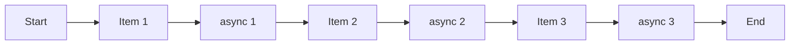
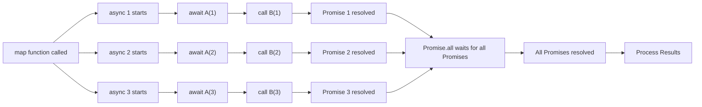

# asynchronous flow code example

## Diagram

### foreach / for of / reduce

- doesn’t wait each async task



### map + Promise.all

  - `map`은 비동기 작업을 즉시 **pending** 상태로 실행시키고, 이를 기다리지 않으며,
  - `Promise.all`이 **모든 비동기 작업이 완료되기를 기다린 후** 결과를 처리합니다.



## Code

- **getAsync 정의**
    
    ```jsx
    const getAsync = (item) => {
      return new Promise((resolve) => {
        setTimeout(() => resolve(item * 2), 1000);
      });
    };
    ```
    
- **foreach**
    
    ```jsx
    [1, 2, 3].forEach(async (before) => {
      const after = await getAsync(before);
    	**// ❌ Cannot wait until getAsync is done.**
    });
    
    Array.prototype.forEach = function (callback) {
      for (let index = 0; index < this.length; index++) {
    		**callback(this[index], index, this);**
        **// Simply calls the callback function.**
      }
    };
    ```
    
- **for of**
    
    ```jsx
    async function processItems() {
      for (const item of [1, 2, 3]) {
        await getAsync(item);
        **//** ✅ **Waits for getAsync to complete before moving to the next item.**
      }
    }
    
    processItems();
    ```
    
- **Promise.all + map**
    - **`map`과 `async` 콜백 함수**
        - `map` 메소드는 각 배열 요소에 대해 `async` 콜백 함수를 호출하며, 이 함수는 `Promise`를 반환합니다.
        - `map`은 동기적으로 호출되지만, 각 콜백 내에서는 `await`로 비동기 작업이 처리됩니다.
    - **콜백 함수 내부**
        - 콜백 함수는 비동기 작업을 수행하고, 최종적으로 `Promise`로 래핑된 값을 반환합니다.
    - **`Promise.all`**
        - `map`이 반환한 `Promise` 배열을 `Promise.all`이 받아 모든 `Promise`가 해결될 때까지 기다립니다.
        - 모든 비동기 작업은 병렬로 처리되며, `Promise.all`은 작업이 완료된 후 결과를 반환합니다.
    
    ```jsx
    const processItems = async (arr) => {
    
        const asyncTasks = arr.map(async (item) => {
            const result = await getAsync(item);
    				// **❌** The callback functions themselves are executed asynchronously and in parallel.
    				// ✅ However, within each callback function, asynchronous tasks are handled in a synchronous flow.
            
            // If there is a synchronous function below, the await code is valid.
    				// If not, the async inside the map callback is not needed.
    
            return result;
        });
        
        console.log("asyncTasks", asyncTasks);
        // [Promise { <pending> }, ..., Promise { <pending> }]
        
        await Promise.all(asyncTasks);
    
    }    
    
    processItems([1,2,3]);
    ```
    
- reduce
    
    ```jsx
    reduce(callback: (acc: U, cur: T) => U, initValue: U): U;
    ```
    
    - **배열의 요소를 순회하며 하나의 값으로 줄여서 요약**
    - `acc`:  누적된 문자열
    - `cur`:현재 배열의 요소
    - `리턴값`: `acc` 에 할당
- **초기값 지정:** 초기값이 없으면 배열의 첫 번째 요소가 초기값으로 사용
- **다양한 반환값:** 숫자뿐만 아니라 배열, 객체, 문자열 등 **다양한 형식의 값**으로 리턴할 수 있음

```jsx
const processItem = async (item) => {
    const result = await getAsync(item);
    return Promise.resolve(result); 
    // Resolves the result of getAsync for the given item.
}

[1, 2, 3].reduce(async (acc, cur) => {
    const item = await acc;
     // Waits for the previous promise to resolve before processing the current item.
    return processItem(cur); 
    // Processes the current item and returns the promise.
}, Promise.resolve());  // Initializes the accumulator with a resolved promise to start the chain.
```

### Example

```tsx
async function migrateScoreToFirebase() {
  try {

    const documents: Array<{ fbUid: string; score: number; createdAt: string }>
     = await MongoDbAPI.getAllUsersFaceDocuments();

    // 비동기 작업을 담을 배열
    const updatePromises: Promise<void>[] = documents.map(async (document) => {
      const { fbUid, score, createdAt } = document;

      const currentScore: number | null = await FirebaseAPI.getGoodScore(fbUid);
      if (currentScore) {
        return;
      }

      if (typeof score === 'number') {
        try {
          await FirebaseAPI.setGoodScore(fbUid, score);
          modifiedCount++;
        } catch (error) {
        }
      }
    });
    
    // 모든 비동기 작업이 완료될 때까지 기다림
    await Promise.all(updatePromises);
  } catch (error) {
  }
}
```