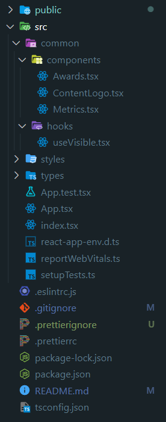

# 홈페이지 한 섹션 클론 코딩

```
1) 숫자는 0부터 증가
2) 좌측 이미지, 리뷰, 수상 내역 순으로 화면에 보여짐
3) 애니메이션 duration은 700ms, 3개의 애니메이션은 100ms 간격으로 차례로 시작
4) 최소 화면폭은 1200px, 반응형 레이아웃 고려X
```

## 결과
  


## 중점 사항

**1) 컴포넌트 설계 및 상태관리**
   * `Styled-Components`를 사용해 기능별 재사용 가능한 컴포넌트 설계하고, `DefaultTheme`을 사용하여 스타일 코드 구분 설계
   * 애니메이션 시작 시간을 `Custom hook`, `useVisible`을 통해 통합 관리

**2) 일관성있는 코드**  
   * `typescript`를 이욯해 데이터 타입 구분  
   * `import`할 때 폴더 구조를 명확하게 하기 위해 `./`표기법 대신 폴더 이름 직접 사용  
       
        ```
        // Metrics.tsx
        import useVisible from 'common/hooks/useVisible';
        import { AnimationProp } from 'types/animationType';
        import { easeOutExpo } from 'styles/animation';
        ```  
   * `eslint`, `prettier`을 사용하여 표준화된 코드 스타일 준수


**3) 화면과 동일한 애니메이션 구현**
   * https://easings.net 사이트에서 해당 Easing Fn 찾기
   * 마지막에 극단적으로 속도가 낮아지는 [easing Exop]함수 발견
   * 해당 함수를 `Countup` 라이브러리 입력 attribute 형식에 맞춰 입력 후 `animation.ts`에서 사용


## 디렉토리  

</img>